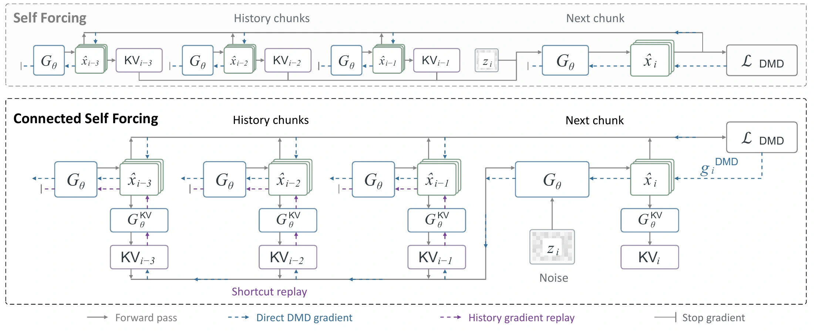

# Connected Self Forcing: Beyond Local Learning in Video Autoregression

Dongbin Zhang1, Chaoda Zheng1,*, Kangjie Chen1, Xiangyu Li1, Shijia Chen1, Jinhao Deng1, Yuqi Zhang1 
Guangfeng Jiang1, Hongbin Lin2, Choo Sin Wai3, Minqi Wang2, Puyi Wang2, Jingye Zhang3 
Yu Zhang1, Xianming Liu1, Boyang Wang1,†

1 XPeng · 2 The Chinese University of Hong Kong · 3 Tsinghua University

* Project lead. † Corresponding author.

[**Paper**](https://arxiv.org/abs/2610.12156) · [**Project Page**](https://eastbeanzhang.github.io/CSF/)

## Introduction

Connected Self Forcing reconnects selected gradient paths across autoregressive video chunks, allowing later predictions to guide how earlier context is generated. Shortcut Gradient Replay recovers this feedback without retaining the full rollout computation graph. The autoregressive inference procedure remains unchanged.

## Pipeline

Feedback from later chunks passes through historical KV states and generated latents to the computations that produced earlier context.

## Code

Code coming soon.
